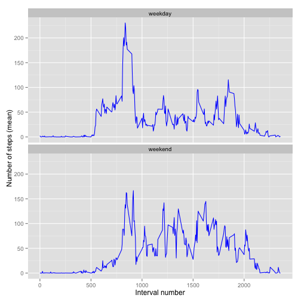

## Abstract

This report presents the results of a data analysis that forms Peer Assessment 1 of the Coursera MOOC Reproducible Research.

The analysis looks at data collected from a personal activity monitoring device. This device collects data at 5 minute intervals through out the day. The data consists of two months of data from an anonymous individual collected during the months of October and November, 2012 and include the number of steps taken in 5 minute intervals each day.

Initially we load some libraries that this analysis is going to use:


```r
library(knitr)
library(data.table)
```

```
## Warning: package 'data.table' was built under R version 3.1.2
```

```r
library(ggplot2)
```

```
## Warning: package 'ggplot2' was built under R version 3.1.3
```

## Loading and preprocessing the data

First of all we load the data from the .csv file into memory using the read.csv function. This assumes that the unzipped .csv file is in the current working directory:


```r
movementData <- read.csv("activity.csv", header=TRUE, colClasses=c("numeric","Date","numeric"))
```

## What is mean total number of steps taken per day?

We create an aggregated variable of steps per day. Looking at the min and max value we find that they range between 41 and 21194. The histrogram therefore uses steps of 1000s for the x axis by specificying 22 breaks.

The mean and median are calculated using the mean() resp. median() functions and turn out to very close together.


```r
spd <- aggregate(steps ~ date, movementData, sum)
max(spd$steps)
```

[1] 21194

```r
min(spd$steps)
```

[1] 41

```r
hist(spd$steps,breaks=22, main="Distribution of steps per day",xlab="Steps per day",ylab="Frequency")
```

 

```r
mean(spd$steps)
```

[1] 10766

```r
median(spd$steps)
```

[1] 10765

## What is the average daily activity pattern?

We create an aggregated variable of steps per time interval and apply the mean function to that. To find the interval with the maximum number of steps, we use which.max.


```r
spi <- aggregate(movementData$steps, by=list(interval=movementData$interval),FUN=mean,na.rm=TRUE)
plot(spi,type="l",xlab="Interval Number",ylab="Number of steps (mean)",main="Average Daily Activity Pattern")
```

 

```r
spi_max <- spi[which.max(spi$x),]
```

It turns out the 835th interval with a mean of 206.1698 steps is the interval with the maximum number of steps.

## Imputing missing values

Initially we calculate the number of missing values:


```r
na_values <- sum(is.na(movementData$steps))
```

The number of missing values is 2304.

Next, we deal with the missing values by replacing them with the mean over the same intervalls across the other days. The resulting dataset is then stored in a data table named movementData_fillin:


```r
na_index <- which(is.na(movementData$steps))
na_replace <- unlist(lapply(na_index, FUN=function(idx){
  interval = movementData[idx,]$interval
  spi[spi$interval == interval,]$x
}))

fillin_steps <- movementData$steps
fillin_steps[na_index] <- na_replace

movementData_fillin <- data.frame(steps=fillin_steps,date=movementData$date,interval=movementData$interval)
```

To make sure we haven't made a mistake, we re-run the calculation on how many NAs we have in the new dataset:


```r
na_values_fillin <- sum(is.na(movementData_fillin$steps))
```

The number of missing values is now 0.

Based on this new dataset a new histogram is created and new values for mean and median are calculated:


```r
spd <- aggregate(steps ~ date, movementData_fillin, sum)
max(spd$steps)
```

[1] 21194

```r
min(spd$steps)
```

[1] 41

```r
hist(spd$steps,breaks=22, main="Distribution of steps per day after filling in NA values",xlab="Steps per day",ylab="Frequency")
```

 

```r
mean(spd$steps)
```

[1] 10766

```r
median(spd$steps)
```

[1] 10766

The calculation shows that there is no significant change in mean (identical) and median (decreased by one) compared to the original (not filled in) dataset.

## Are there differences in activity patterns between weekdays and weekends?

The code below is splitting the dataset into a weekend and weekdays part each and then creates a comparison plot using ggplot.

```r
movementData_fillin$weekday <- as.factor(weekdays(movementData_fillin$date))
weekend_data <- subset(movementData_fillin, weekday %in% c("Saturday","Sunday"))
weekday_data <- subset(movementData_fillin, !weekday %in% c("Saturday","Sunday"))

# calculate weekday and weekend steps
weekdays_steps <- aggregate(weekday_data$steps, by=list(interval=weekday_data$interval),FUN=mean, na.rm=T)
weekend_steps <- aggregate(weekend_data$steps, by=list(interval=weekend_data$interval),FUN=mean, na.rm=T)

weekdays_steps$dayofweek <- rep("weekday", nrow(weekdays_steps))
weekend_steps$dayofweek <- rep("weekend", nrow(weekend_steps))

data_by_weekdays <- rbind(weekend_steps, weekdays_steps)
data_by_weekdays$dayofweek <- as.factor(data_by_weekdays$dayofweek)

ggplot(data_by_weekdays, aes(x=interval, y=x)) + 
  geom_line(color="blue") + 
  facet_wrap(~ dayofweek, nrow=2, ncol=1) +
  labs(x="Interval number", y="Number of steps (mean)")
```

 

The plot shows that there seems to be a greater amount of general activity on weekends, more uniformly distributed during the day. There are multiple peaks between the values of 100-150 steps per interval and those don't exist on week days. However on week days there is a clearly noticeable peak above 200 steps per interval --- this could be due to a morning exercise regime during the common work week.

